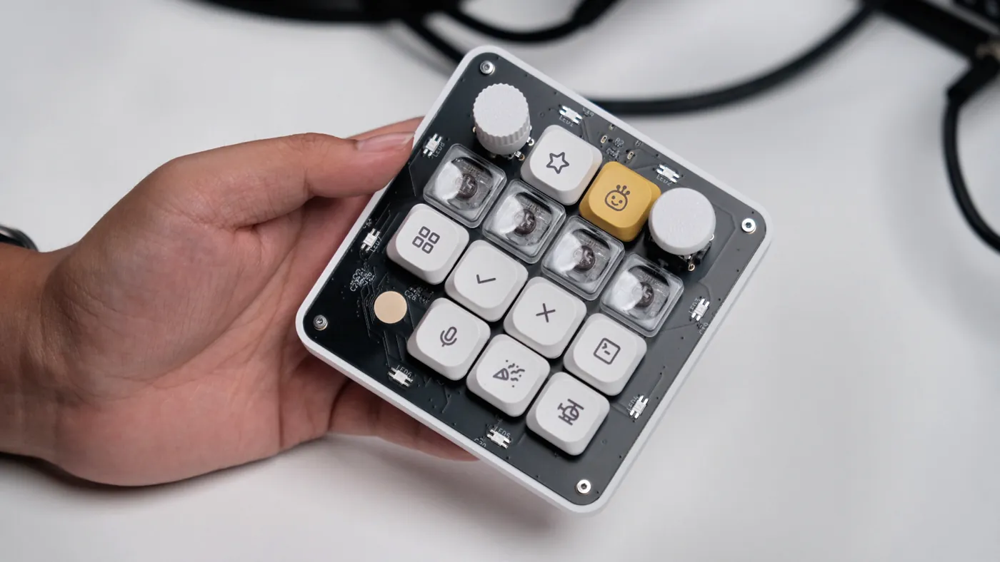

<picture>
  <source media="(prefers-color-scheme: dark)" srcset="site/public/assets/wordmark-dark.png">
  
</picture>

# OpenMicroKbd

An open-source hardware recreation of OpenAI's **Codex Micro** macropad — 13 low-profile keys, a rotary encoder, an analog joystick, a capacitive touch pad, and per-key + underglow RGB on a wired USB-C board built around an STM32F072.

[](https://openmicrokbd.org/blog/openmicrokbd-launch/)

*The finished board — read the [launch post](https://openmicrokbd.org/blog/openmicrokbd-launch/) for the full story.*

**The PCB is written, not drawn.** The entire schematic is source code in **CoHDL**, a new AI-native hardware description language (see below). The compiler type-checks the design — units, pin-connection obligations, power integrity — and emits the netlist, BOM, footprints and layout constraints you can inspect under [`hw/v1/out/`](hw/v1/out/).

🌐 **https://openmicrokbd.org** · License: [MIT](LICENSE)

## Designed in CoHDL

This board was designed in **CoHDL**, a hardware description language newly developed by [Tony Huang](https://github.com/conol-ai) that makes schematic (PCB) design AI-native: a board is a program — typed, checked, and compiled. In CoHDL, the design in [`hw/v1/src/`](hw/v1/src/) *is* the schematic; the compiler is the oracle that grades it.

**The CoHDL language and compiler will be open sourced soon.** Until then, this repository ships the complete compiler outputs under `hw/*/out/`, so the design is fully inspectable and the firmware and app are buildable today.

## What's inside

| Path | Contents |
|---|---|
| [`hw/v1/src/`](hw/v1/src/) | The PCB as CoHDL source: `main.cohdl` (top-level design), `openmicro_parts.cohdl` (datasheet-verified part bindings), `footprints.cohdl`, `pads.cohdl` |
| [`hw/v1/out/`](hw/v1/out/) | Checked-in compiler output: KiCad netlist (`openmicro.net`), BOM (`openmicro-bom.csv`), SMT placement (`openmicro-smt.csv`), `.kicad_mod` footprints, layout constraints (`openmicro-layout.json`) |
| [`hw/v1/pcb/`](hw/v1/pcb/) | The routed board — `openmicro.kicad_pcb` + KiCad project (design rules) |
| [`hw/v1/fab/`](hw/v1/fab/) | Manufacturing package: Gerber/drill zip, assembly BOM, SMT placement CSV — see [`hw/v1/fab/README.md`](hw/v1/fab/README.md) |
| [`hw/v1/mechanical/`](hw/v1/mechanical/) | Board outline (DXF) plus the printable enclosure parts — case, rotary knob, joystick cap, shipping tray and a solder-assembly jig, as editable Fusion 360 `.f3d` and ready-to-slice `.3mf` |
| [`hw/v1/docs/`](hw/v1/docs/) | Manufacturer datasheets for every active, connector, and electromechanical part in the BOM, with sourcing/verification notes — see [`hw/v1/docs/README.md`](hw/v1/docs/README.md) |
| [`hw/v2/`](hw/v2/) | **Hardware v2, in development** — wireless successor on the SiFli SF32LB52 (BLE, battery-powered): CoHDL source + compiler outputs, not yet routed. See [`hw/v2/README.md`](hw/v2/README.md) |
| [`fw/`](fw/) | Firmware — Rust + [embassy](https://embassy.dev) on STM32F072CB: key matrix, twin WS2812 chains, USB HID + vendor interface, DFU reboot. See [`fw/README.md`](fw/README.md) |
| [`app/`](app/) | Companion desktop app — Rust + [GPUI](https://gpui.rs), with a crisp 8-bit visual system: device dashboard, live connection state, and button-free firmware updates over USB. See [`app/README.md`](app/README.md) |

## Hardware (v1)

- **MCU:** STM32F072CBT6 (Cortex-M0), 8 MHz HSE crystal, 2×3 SWD debug socket
- **Keys:** 13× Kailh Choc V2 low-profile switches on a 19.05 mm grid (square 4×4-cell frame, matching the Codex Micro layout), 1N4148W per-key matrix diodes
- **Inputs:** EC11 rotary encoder, RKJXV analog joystick, capacitive touch pad
- **Lighting:** 13× per-key SK6812MINI-E (reverse-mount, one WS2812 chain) + 8× perimeter underglow SK6812MINI-E (second chain)
- **USB:** Type-C wired, USBLC6 ESD protection, AP2112 3.3 V LDO
- PCB laid out from the CoHDL-generated constraints; manufacturing handoff via IPC-2581

## Building

```sh
# Production firmware binary + debug ELF
scripts/build-firmware.sh dist

# Native GPUI macOS app bundle + DMG (ad-hoc signed for local testing)
scripts/package-macos.sh dist dist/openmicro-fw-<firmware-version>.bin

# Or run the companion app from source
cd app && cargo run --release --locked
```

Rebuilding a PCB from `hw/*/src/` requires the CoHDL compiler, which is being prepared for open source — the generated netlist/BOM/footprints are checked in under `hw/*/out/` in the meantime.

Signed releases build both Intel and Apple Silicon DMGs plus firmware through
GitHub Actions. See [`RELEASING.md`](RELEASING.md) for versioning, Apple
signing/notarization secrets, the required device smoke test, and the tag flow.
Linux packaging, USB permissions, and the STM32F072 ROM-DFU host-controller
workaround are tracked in
[`docs/linux-firmware-updates.md`](docs/linux-firmware-updates.md).

## Production files

The final routed v1 board lives in [`hw/v1/pcb/`](hw/v1/pcb/) (`openmicro.kicad_pcb`, opens in KiCad 9+). The manufacturing package — Gerber/drill zip, assembly BOM, and SMT pick-and-place CSV, ready to upload to a fab such as JLCPCB — is in [`hw/v1/fab/`](hw/v1/fab/), with DRC status and ordering notes in [`hw/v1/fab/README.md`](hw/v1/fab/README.md).

## License

[MIT](LICENSE) © 2026 Tony Huang. Build your own — attribution appreciated.

---

*OpenMicroKbd is an independent open-source project and is not affiliated with, endorsed by, or sponsored by OpenAI. "Codex Micro" refers to OpenAI's product; all trademarks belong to their respective owners.*
